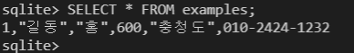

# DB


#### 데이터베이스 ( DB )

> 데이터베이스는 **체계화된 데이터**의 모임이다.
>
> 여러 사람이 공유하고 사용할 목적으로 통합 관리되는 정보의 집합이다.
>
> 논리적으로 연관된 (하나 이상의) 자료의 모음으로 그 내용을 고도로 구조화 검색과 생신의 효율화를 꾀한 것이다.
>
> 즉, **몇 개의 자료 파일을 조직적으로 통합**하여 **자료 항목의 중복을 없애**고 **자료를 구조화하여 기억**시켜 놓은 **자료의 집합체**


#### 데이터베이스로 얻는 장점들

- 데이터 중복 최소화
- 데이터 무결성 (정확한 정보를 보장)
- 데이터 일관성
- 데이터 독립성 (물리적 / 논리적)
- 데이터 표준화
- 데이터 보안 유지


-----


### RDB


#### 관계형 데이터베이스 (RDB)

- Relational Database
- 키(key)와 값(value)들의 간단한 관계(relation)를 표(table) 형태로 정리한 데이터베이스
- 관계형 모델에 기반


#### 관계형 데이터베이스 용어 정리

- 스키마( schema ): 데이터베이스에서 자료 구조, 표현방법, 관계 등 전반적인 **명세를 기술**한 것.

  

  

- 테이블( table ): 열(컬럼 / 필드)과 행(레코드 / 값)의 모델을 사용해 조직된 데이터 요소들의 집합

  


- 열( Column ): 각 열에는 고유한 데이터 형식이 지정됨
  - 아래의 예시에서는 name 이란 필드에 고객의 이름 (TEXT) 정보가 저장됨.
  
  


- 행( row ): 실제 데이터가 저장되는 형태
  - 아래의 예시에서는 총 3명의 고객정보가 저장되어 있음 (레코드가 3개)
  
  


- 기본키 ( Primary Key ): 각 행(레코드)의 고유 값

  - 반드시 설정해야 하며, 데이터베이스 관리 및 관계 설정 시 주요하게 활용 됨.

  


-----


### RDBMS


#### 관계형 데이터베이스 관리 시스템 (RDBMS)

- Relational Database Management System
- 관계형 모델을 기반으로 하는 데이터베이스 관리시스템을 의미
- 예시)
  - MySQL
  - SQLite
  - PostgreSQL
  - ORACLE
  - MS SQL


#### SQLite

> 서버 형태가 아닌 파일 형식으로 응용 프로그램에 넣어서 사용하는 **비교적 가벼운 데이터베이스**
>
> 구글 안드로이드 운영체제에 기본적으로 탑재된 데이터베이스이며, 임베디드 소프트웨어에도 많이 활용됨
>
> 로컬에서 간단한 DB 구성을 할 수 있으며, 오픈소스 프로젝트이기 때문에 자요롭게 사용 가능


```bash
+
$ source ~/.bashrc
```

code ~/.bashrc로 수정을 한 뒤에

source ~/.bashrc로 적용한다.


-----


### SQL


#### SQL (Structured Query Language)

- 관계형 데이터베이스 관리시스템의 **데이터 관리**를 위해 설계된 **특수 목적으로 프로그래밍 언어**

- 데이터베이스 스키마 생성 및 수정
- 자료의 검색 및 관리
- 데이터베이스 객체 접근 조정 관리


#### SQL 분류


#### SQL Keywords - Data Manipulation Laguage

- INSERT : 새로운 데이터 삽입 (추가)
- SELECT : 저장되어있는 데이터 조회
- UPDATE : 저장되어있는 데이터 갱신
- DELETE : 저장되어있는 데이터 삭제


-----


### 테이블 생성 및 삭제

- bash창 초기화

  ```sqlite
  .shell cls
  ```


- 진행 TIP

  - vscode 화면을 좌우로 나누어서 진행
    1. 좌측 (sql 확장자 파일)
       - 명령어 기록 및 누적 (개념 정리)
       - 좌측에서 먼저 명령어 입력 후 우측으로 복붙
    2. 우측 (터미널, db.sqlite3)
       - 명령어 작성 및 결과 확인

  - View - Appearance - Move Panel Right


#### csv 파일 다운로드

- https://abit.ly/ssafy-db	-  SQL 폴더
- SQL 실습을 위한 별도의 폴더(99_sql) 생성 및 csv 파일 다운로드


##### 데이터베이스 생성하기

> '.' 은 sqlite 프로그램의 기능을 실행하는 것

그 폴더안에서 VSCode 활성화

```sqlite
$ sqlite3 tutorial.sqlite3

sqlite> .database
```

##### csv 파일을 table로 만들기

```sqlite
sqlite> .mode csv
sqlite> .import hellodb.csv examples
sqlite> .tables
```

> .tables를 통해 생성된 examples라는 table이 생성되었음을 알 수 있다.


#### SELECT

```sql
SELECT * FROM examples;
# SELECT : 조회, * : 모든컬럼, examples : table
```

> ; 까지 하나의 명령 (SQL Query)로 간주 됨!
>
> SELECT 문은 특정 테이블의 레코드(행) 정보를 반환!



##### (Optional) 터미널 view 변경하기

```sqlite
sqlite> .headers on
sqlite> .mode on
```

> 위의 명령어를 지정하면


> 다음과 같이 확인이 가능하다.


#### 테이블 생성 및 삭제 statement

- **CREATE TABLE**

  - 데이터베이스에서 테이블 생성

    ```sql
    CREATE TABLE classmate(
    id INTEGER PRIMARY KEY,
    name TEXT
    );
    ```

    

    > .tables로 확인하면 classmate라는 테이블이 생성이 되어있음을 알 수 있다.

    

  - 특정 테이블의 schema 조회

    

    

- **DROP TABLE**

  - 데이터베이스에서 테이블 제거

  ```sql
  DROP TABLE classmate;
  ```

  

  > .tables로 확인하면 classmate라는 테이블이 삭제가 되었음을 알 수 있다.

  

####  실습

- 다음과 같은 스키마(schema)를 가지고 있는 classmates 테이블을 만들고 스키마를 확인해보세요.

  


- CREATE TABLE

  ```sql
  CREATE TABLE classmates(
  name TEXT,
  age INT,
  address TEXT
  );
  ```

- Schema로 확인

  


-----


### CRUD


#### CREATE


##### INSERT

- inserting a single row into a table
- 테이블에 단일 행 삽입

```sql
INSERT INTO 테이블이름 (컬럽1, 컬럼2, ... ) VALUES (값1, 값2, ... );
```

> **INSERT는 특정 테이블에 레코드(행)를 삽입(생성)!**

<question>

classmates 테이블에 이름이 홍길동이고 나이가 23인 


​				아무 이상이 없다면 제대로 INSERT가 되었음을 나타낸다.


##### 정상 동작은 하지만 2가지 의문점이 발생

1. **id는 어디로 갔을까?**

- rowid 사용

  - 따로 id값을 지정해주지 않아도 해당하는 값을 알 수 있다.

  
  
  > **모든 열에 데이터가 있는 경우 column을 명시하지 않아도 됨!**
  >
  > SQLite는 따로 **PRIMARY KEY 속성의 컬럼을 작성하지 않으면** 값이 자동으로 증가하는 PK 옵션을 가진 **rowid 컬럼을 정의**


- 컬럼 사용

  - 컬럼값을 넣음으로써 해당하는 컬럼에 존재하는 데이터들을 뽑을 수 있다.

  


2. **비어있는 1호 홍길동씨의 주소**

   > 주소가 꼭 필요한 정보라면 공백으로 비워두면 안된다!  ( NOT NULL 설정 필요! )

```sql
-- 새로운 classmates 테이블 생성
CREATE TABLE classmates (
id INTEGER PRIMARY KEY,
name TEXT NOT NULL,
age INT NOT NULL,
address TEXT NOT NULL
);
```

​		INT와 INTEGER는 서로 다른 걸 표현한다! (같은 표현이 아님을 깨닫자!!)

- 다시 INSERT 사용해보기

  ```sql
  INSERT INTO classmates VALUES ('홍길동', 30, '서울');
  ```

- 결과 == 실패!

  > **스키마에 id를 직접 작성했기 때문에 입력할 column들을 명시하지 않으면 자동으로 입력되지 않음**

  1. 첫 번째 방법

     - **id를 포함한 모든 value를 작성**

     ```sql
     INSERT INTO classmates VALUES (1, '홍길동', 30, '서울');
     ```

  2. 두 번째 방법

     - **각 value에 맞는 column들을 명시적으로 작성**

     ```sql
     INSERT INTO classmates (name, age, address) VALUES ('홍길동', 30, '서울');
     ```

     

##### 실습 - INSERT 직접 해보기

- 방금 새롭게 생성한 테이블에 다음과 같은 정보를 저장하고 확인

- 각 정보는 이름 / 나이 / 주소로 구분된다.

  - 홍길동 / 30 / 서울
  - 김철수 / 30 / 대전
  - 이싸피 / 26 / 광주
  - 박삼성 / 29 / 구미
  - 최전자 / 28 / 부산

  ```sql
  -- sql
  INSERT INTO classmates VALUES
  ('홍길동', 30, '서울'),
  ('김철수', 30, '대전'),
  ('이싸피', 26, '광주'),
  ('박삼성', 29, '구미'),
  ('최전자', 28, '부산');
  ```

  

-----


### READ


#### SELECT statement

- **SELECT**
  - to query data from a table
  - 테이블에서 데이터를 조회
  - SELECT 문은 SQLite에서 가장 복잡한 문이며 다양한 절(clause)와 함께 사용
    - `ORDER BY`, `DISTINCT`, `WHERE`, `LIMIT`, `GROUP BY` ...


#### SELECT와 함께 사용하는 clause

- **LIMIT**
  - to constrain the number of rows returned by a query.
  - 쿼리에서 반환되는 행 수를 제한
  - 특정 행부터 시작해서 조회하기 위해 **OFFSET** 키워드와 함께 사용하기도 함


- **Where**
  - to specify the search conditions for rows returned by the query.
  - 쿼리에서 반환된 행에 대한 특정 검색 조건을 지정


- **SELECT DISTINCT**
  - to remove duplicate rows in the result set.
  - 조회 결과에서 중복 행을 제거
  - DISTINCT 절은 SELECT 키워드 바로 뒤에 작성해야 함


#### SELECT statement

> 모든 컬럼 값이 아닌 특정 컬럼만 조회하기!

```sql
SELECT 컬럼1, 컬럼2, ... FROM 테이블이름;
```

- classmates 테이블에서 id, name 컬럼 값만 조회하기

  ```sql
  SELECT rowid, name FROM classmates;
  ```


##### LIMIT

> 원하는 수 만큼 데이터 조회하기

```sql
SELECT 컬럼1, 컬럼2, ... FROM 테이블이름 LIMIT 숫자;
```

- classmates 테이블에서 id, name 컬럼 값을 하나만 조회하세요.

  ```SQL
  SELECT rowid, name FROM classmates LIMIT 1;
  ```

  

##### OFFSET

> 특정 부분에서 원하는 수 만큼 데이터 조회하기

```sql
SELECT 컬럼1, 컬럼2, ... FROM 테이블이름 LIMIT 숫자 OFFSET 숫자;
```

- classmates 테이블에서 id, name 커럼 값을 세 번째에 있는 하나만 조회하세요.

  ```sql
  SELECT rowid, name FROM classmates LIMIT 1 OFFSET 2;
  ```

  

##### WHERE

> 특정 데이터(조건) 조회하기

```sql
SELECT 컬럼1, 컬럼2, ... FROM 테이블이름 WHERE 조건
```

- classmates 테이블에서 id, name 컬럼 값 중에 주소가 서울인 경우의 데이터를 조회하세요.

  ```sql
  SELECT rowid, name FROM classmates WHERE address='서울';
  ```

  

##### DISTINCT

> 특정 컬럼을 기준으로 중복없이 가져오기

```sql
SELECT DISTINCT 컬럼 FROM 테이블이름;
```

- classmates 테이블에서 age값 전체를 중복없이 조회하세요.

  ```sql
  SELECT DISTINCT age FROM classmates;
  ```

  


-----


### DELETE


#### DELETE statement

##### DELETE

- to remove rows from a table.
- 테이블에서 행을 제거

> 조건을 통해 특정 레코드 삭제하기

```sql
DELETE FROM 테이블이름 WHERE 조건;
```

-> 그럼 어떤 기준으로 데이터를 삭제하면 좋을까?

==> 답 : **중복 불가능한(UNIQUE) 값인 rowid를 기준으로 삭제하자!**


- classmates 테이블에 id가 5인 레코드를 삭제하세요.

  ```sql
  DELETE FROM classmates WHERE rowid=5;
  ```


- SQLite는 기본적으로 id를 **재사용**
  - 즉, 지웠다가 새로운 값을 다시 생성해도 rowid는 같아진다.


#### AUTOINCREMENT

- Column attribute

- SQLite가 사용되지 않은 값이나 이전에 삭제된 행의 값을 재사용하는 것을 방지!

  ```sql
  CREATE TABLE 테이블이름 (
  id INTEGER PRIMARY KEY AUTOINCREMENT,
  ...
  );
  ```

- **테이블을 생성하는 단계에서** `AUTOINCREMENT`를 통해 설정 가능


-----


### UPDATE


#### UPDATE statement

##### UPDATE

- to update data of existing rows in the table.
- 기존 행의 데이터를 수정
- **SET** clause에서 테이블의 각 열에 대해 새로운 값을 설정


> 조건을 통해 특정 레코드 수정하기
>
> **중복 불가능한(UNIQUE)값인 rowid를 기준으로 수정하자!**

```sql
UPDATE 테이블이름 SET 컬럼1=값1, 컬럼2=값2, ... WHERE 조건
```

- classmates 테이블에 id가 5인 레코드를 이름을 홍길동으로, 주소를 제주도로 바꿔주세요.

  ```sql
  UPDATE classmates SET name='홍길동', address='제주도' WHERE rowid=5;
  ```

  


#### CRUD 정리하기


-----


### WHERE

- Table users 생성

  ```sql
  CREATE TABLE users (
  first_name TEXT NOT NULL,
  last_name TEXT NOT NULL,
  age INTEGER NOT NULL,
  country TEXT NOT NULL,
  phone TEXT NOT NULL,
  balance INTEGER NOT NULL
  );
  ```

- csv 파일 정보를 테이블에 적용하기

  ```sqlite
  sqlite> .mode csv
  sqlite> .import users.csv users
  sqlite> .tables
  ```


- WHERE

  ```sql
  SELECT * FROM 테이블이름 WHERE 조건;
  ```

  - users 테이블에서 age가 30 이상인 유저의 모든 컬럼 정보를 조회하려면?

    ```sql
    SELECT * FROM users WHERE age >= 30;
    ```

  - users 테이블에서 age가 30이상인 유저의 이름만 조회하려면?

    ```sql
    SELECT first_name FROM users WHERE age>=30;
    ```

  - users 테이블에서 age가 30 이상이고 성이 ‘김’인 사람의 나이와 성만 조회하려면?

    ```sql
    SELECT age, last_name FROM users WHERE age>=30 AND last_name='김';
    ```

    


-----


### Sqlite Aggregate Functions

- COUNT

  - 그룹의 항목 수를 가져옴

  > 레코드의 개수 조회하기

  ```sql
  SELECT COUNT(컬럽) FROM 테이블이름;
  ```

  - users 테이블의 레코드 총 개수를 조회한다면?

    ```sql
    SELECT COUNT(*) FROM users;
    ```

    

  

- AVG

  - 값 집합의 평균 값을 계산

- MAX

  - 그룹에 있는 모든 값의 최대값을 가져옴

- MIN

  - 그룹에 있는 모든 값의 최소값을 가져옴

- SUM

  - 모든 값의 합을 계산

> 위의 함수들은 기본적으로 해당 컬럼이 숫자(INTEGER)일 때만 사용 가능

```sql
SELECT AVG(컬럼) FROM 테이블이름;
SELECT SUM(컬럼) FROM 테이블이름;
SELECT MAX(컬럼) FROM 테이블이름;
SELECT MIN(컬럼) FROM 테이블이름;
```

- 30살 이상인 사람들의 평균 나이는?

  ```sql
  SELECT AVG(age) FROM users WHERE age>=30;
  ```

- 계좌 잔액(balance)이 가장 높은 사람과 그 액수를 조회하려면?

  ```sql
  SELECT first_name, MAX(balance) FROM users;
  ```

- 나이가 30 이상인 사람의 계좌 평균 잔액을 조회하려면?

  ```sql
  SELECT AVG(balance) FROM users WHERE age>=30;
  ```

  

-----


### LIKE


#### LIKE operator

- to query data based on pattern matching
- 패턴 일치를 기반으로 데이터를 조회하는 방법
- sqlite는 패턴 구성을 위한 2개의 wildcards를 제공
  - % (percent sign)
    - 0개 이상의 문자
    - 이 자리에 문자열이 있을 수도, 없을 수도 있다.
  - _ (underscore)
    - 임의의 단일 문자
    - 반드시 이 자리에 한 개의 문자가 존재해야 한다.

> 패턴을 확인하여 해당하는 값을 조회하기

```sql
SELECT * FROM 테이블 WHERE 컬럼 LIKE '와일드카드패턴';
```


- users 테이블에서 나이가 20대인 사람만 조회한다면?

  ```sql
  SELECT * FROM users WHERE age LIKE '2_';
  ```

- users 테이블에서 지역 번호가 02인 사람만 조회한다면?

  ```sql
  SELECT * FROM users WHERE phone LIKE '02-%';
  ```

- users 테이블에서 이름이 ‘준’으로 끝나는 사람만 조회한다면?

  ```sql
  SELECT * FROM users WHERE first_name LIKE '%준';
  ```

- users 테이블에서 중간 번호가 5114인 사람만 조회한다면?

  ```sql
  SELECT * FROM users WHERE phone LIKE '%-5114-%';
  ```

  

---


### ORDER BY


#### ORDER BY clause

- to sort a result set of a query
- 조회 결과 집합을 정렬
- SELECT 문에 추가하여 사용
- 정렬 순서를 위한 2개의 keyword 제공
  - ASC - 오름차순 (defalut)
  - DESC - 내림차순


> 특정 컬럼을 기준으로 데이터를 정렬해서 조회하기

```sql
SELECT * FROM 테이블 ORDER BY 컬럼 ASC;
SELECT * FROM 테이블 ORDER BY 컬럼1, 컬럼2 DESC;
```


-  users 에서 나이 순으로 오름차순 정렬하여 상위 10개만 조회한다면?

  ```sql
  SELECT * FROM users ORDER BY age ASC LIMIT 10;
  ```

- 나이 순, 성 순으로 오름차순 정렬하여 상위 10개만 조회한다면?

  ```sql
  SELECT * FROM users ORDER BY age, last_name ASC LIMIT 10;
  ```

- 계좌 잔액 순으로 내림차순 정렬하여 해당 유저의 성과 이름을 10개만 조회한다면?

  ```sql
  SELECT last_name, first_name FROM users ORDER BY balance DESC LIMIT 10;
  ```

- 나이는 오름차순 성은 내림차순으로 조회한다면?

  ```sql
  SELECT * FROM users ORDER BY age ASC, last_name DESC
  ```

  

-----


### GROUP BY


#### GROUP BY clause

- to make a set of summary rows from a set of rows.
- 행 집합에서 요약 행 집합을 만듦
- SELECT 문의 optional 절
- 선택된 행 그룹을 하나 이상의 열 값으로 요약 행으로 만듦
- 문장에 WHERE 절이 포함된 경우 반드시 **WHERE 절 뒤에 작성해야함**


> 지정된 기준에 따라 행 세트를 그룹으로 결합
> 데이터를 요약하는 상황에 주로 사용

```sql
SELECT 컬럼1, aggregate_function(컬럼2) FROM 테이블 GROUP BY 컬럼1, 컬럼2;
```


- users에서 각 성(last_name)씨가 몇 명씩 있는지 조회한다면?

  ```sql
  SELECT last_name, COUNT(*) FROM users GROUP BY last_name;
  ```

  ```sql
  SELECT last_name, COUNT(*) AS name_count FROM users GROUP BY last_name;
  ```

  > **AS**를 활용해서 COUNT에 해당하는 **컬럼 명을 바꿔서 조회**할 수 있음

  

  

-----


### ALTER TABLE

- title과 content라는 컬럼을 가진 articles라는 이름의 table을 새롭게 만들어보세요!

  ```sql
  CREATE TABLE articles (
  title TEXT NOT NULL,
  content TEXT NOT NULL
  );
  ```

-  articles 테이블에 값을 추가해보세요!

  ```sql
  INSERT INTO articles VALUES ('1번제목', '1번내용');
  ```

  

#### ALTER TABLE의 3가지 기능

1. table 이름 변경

   > 방금 만든 테이블 이름 변경

   ```sql
   ALTER TABLE 기존테이블이름 RENAME TO 새로운테이블이름;
   ```

   - ex) articles 테이블 이름을 news로 변경

     ```sql
     ALTER TABLE articles RENAME TO news;
     ```

   

2. 테이블에 새로운 column 추가

   > 방금 만든 테이블에 새로운 컬럼 추가

   ```sql
   ALTER TABLE 테이블이름 ADD COLUMN 컬럼이름 데이터타입설정;
   ```

   - 새로운 컬럼 이름은 created_at 이며, TEXT 타입에 NULL 설정!

     ```sql
     ALTER TABLE news ADD COLUMN created_at TEXT NOT NULL;
     ```

     > 이때, 테이블에 있던 기존 레코드들에는 새로 추가할 필드에 대한 정보가 없다!
     > 그렇기 때문에 NOT NULL 형태의 컬럼은 추가가 불가능!
     >
     > 해결방법 2가지
     >
     > 1. NOT NULL 설정 없이 추가하기!
     >
     > ```sql
     > ALTER TABLE news ADD COLUMN created_at TEXT;
     > ```
     >
     > 2. 기본 값(DEFALUT) 설정하기
     >
     > ```sql
     > ALTER TABLE news ADD COLUMN subtitle TEXT NOT NULL DEFAULT '소제목';
     > ```

     

3. [참고] column 이름 수정

   ```sql
   ALTER TABLE table_name
   RENAME COLUMN current_name TO new_name;
   ```

   

-----


### SQL & ORM


#### Django Project Setting

1. 다운로드한 django 프로젝트에서 가상환경 적용하기

   ```bash
   $ python -m venv venv
   $ source venv/Scripts/activate
   ```

   

2. requirements.txt파일로 실습환경 구성하기

   ```bash
   $ pip install -r requirements.txt
   ```

   

3. migrate 진행하기

   ```bash
   $ python manage.py migrate
   $ python manage.py sqlmigrate users 0001
   ```


4. db.sqlite3 실행하기

   ```bash
   $ sqlite3 db.sqlite3
   ```

   

5. csv 파일을 데이터 베이스에 적용하기

   ```sqlite
   sqlite> .mode csv
   sqlite> .import users.csv users_user
   sqlite> SELECT * FROM users_user;
   ```

   

6. 스키마 확인

   ```sqlite
   sqlite> .schema users_user
   ```

   


7. headers on (Optional)

   ```sqlite
   sqlite> .headers on
   ```


#### shell 정리 및 종료

- in sqlite
  - shell clear
  - .exit


- in django_shell_plue
  - clear
  - exit


-----


### 1. CRUD


#### READ

- 모든 user 레코드 조회

```python
# orm
User.objects.all()
```

```sql
-- sql
SELECT * FROM users_user;
```


#### CREATE

- user 레코드 생성 및 조회

```python
# orm
# 생성
User.objects.create(
    first_name='길동', 
    last_name='홍', 
    age=100, 
    country='제주도', 
    phone='010-1234-5678', 
    balance=10000
)

# 조회
User.objects.get(pk=102)
```

```sql
-- sql
-- 생성
INSERT INTO users_user VALUES(102, '길동', '김', 100, '경상북도', '010-1234-1234', 100);

-- 조회
SELECT * FROM users_user
WHERE id=102;
```

> 하나의 레코드를 빼고 작성 후 `NOT NULL` constraint 오류를 orm과 sql에서 모두 확인 해보세요.


- user 레코드 생성 실패 예시

  - 1.

    

  - 2.

    

  - 3.

    


- NOT NULL constraint failed를 ORM에서 확인해보자

  


#### UPDATE

- 해당 user 레코드 수정

  - ORM: `102` 번 글의 `last_name` 을 '김' 으로 수정
  - SQL: `102` 번 글의 `first_name` 을 '철수' 로 수정

  ```python
  # orm
  user = User.objects.get(pk=102)
  user.last_name = '박'
  user.save()
  ```

     ```sql
  -- sql
  UPDATE users_user SET first_name='철수' WHERE id=102;
     ```

  

#### DELETE

- 해당 user 레코드 삭제

  - ORM: `102` 번 글 삭제 => 조회했을 때 해당 pk값이 없으면 ERROR가 발생한다.
  - `SQL`:  `101` 번 글 삭제 => 조회했을 때 해당 pk값이 없으면 아무것도 반환하지않는다.

  ```python
  # orm
  User.objects.get(pk=102).delete()
  ```

  ```sql
  -- sql
  DELETE FROM users_user WHERE id=101;
  ```

  

----


### 2. 조건에 따른 쿼리문

1. 전체 인원 수 

   - `User` 의 전체 인원수

   ```python
   # orm
   User.objects.count()
   ```

   ```sql
   -- sql
   SELECT COUNT(*) FROM users_user;
   ```

   

2. 나이가 30인 사람의 이름

   - `ORM` : `.values` 활용
     - 예시: `User.objects.filter(조건).values(컬럼이름)`

   ```python
   # orm
   User.objects.filter(age=30).values('first_name')
   print(User.objects.filter(age=30).values('first_name').query)
   ```

      ```sql
   -- sql
   SELECT first_name FROM users_user WHERE age=30;
      ```

   

3. 나이가 30살 이상인 사람의 인원 수

   -  ORM: `__gte` , `__lte` , `__gt`, `__lt` -> 대소관계 활용

   ```python
   # orm
   User.objects.filter(age__gte=30).count()
   ```

      ```sql
   -- sql
   SELECT COUNT(*) FROM users_user WHERE age>=30;
      ```

   

4. 나이가 20살 이하인 사람의 인원 수 

   ```python
   # orm
   User.objects.filter(age__lte=20).count()
   ```

   ```sql
   -- sql
   SELECT COUNT(*) FROM users_user WHERE age<=20;
   ```

   

5. 나이가 30이면서 성이 김씨인 사람의 인원 수

   ```python
   # orm
   User.objects.filter(age=30, last_name='김').count()
   ```

      ```sql
   -- sql
   Select COUNT(*) FROM users_user WHERE age=30 AND last_name='김';
      ```

   

6. 나이가 30이거나 성이 김씨인 사람?

   ```python
   # orm
   from django.db.models import Q
   User.objects.filter(Q(age=30) | Q(last_name='김')).count()
   ```

   ```sql
   -- sql
   SELECT COUNT(*) FROM users_user WHERE age=30 OR last_name='김';
   ```

   

7. 지역번호가 02인 사람의 인원 수

   - `ORM`: `__startswith` 

   ```python
   # orm
   User.objects.filter(phone__startswith='02-').count()
   ```

      ```sql
   -- sql
   SELECT COUNT(*) FROM users_user WHERE phone LIKE '02-%';
      ```

   

8. 거주 지역이 강원도이면서 성이 황씨인 사람의 이름

   ```python
   # orm
   User.objects.filter(country='강원도', last_name='황').values('first_name')
   ```

      ```sql
   -- sql
   SELECT first_name FROM users_user WHERE country='강원도' AND last_name='황';
      ```


---


### 3. 정렬 및 LIMIT, OFFSET

1. 나이가 많은 사람순으로 10명

   ```python
   # orm
   User.objects.order_by('-age')[:10]
   ```

      ```sql
   -- sql
   SELECT * FROM users_user ORDER BY age DESC LIMIT 10;
      ```

   

2. 잔액이 적은 사람순으로 10명

   ```python
   # orm
   User.objects.order_by('balance')[:10]
   ```

      ```sql
   -- sql
   SELECT * FROM users_user ORDER BY balance ASC LIMIT 10;
      ```

   

3. 잔고는 오름차순, 나이는 내림차순으로 10명?

   ```python
   # orm 두 값이 다름을 catch!!
   User.objects.order_by('balance', '-age')[:10]
   User.objects.order_by('-age', 'balance')[:10]
   ```

   ```sql
   -- sql 두 값이 다름을 catch!!
   SELECT * FROM users_user ORDER BY balance ASC, age DESC LIMIT 10;
   SELECT * FROM users_user ORDER BY age DESC, balance ASC LIMIT 10;
   ```

   

4. 성, 이름 내림차순 순으로 5번째 있는 사람

   ```python
   # orm
   User.objects.order_by('-last_name', '-first_name')[4]
   ```

      ```sql
   -- sql
   SELECT * FROM users_user ORDER BY last_name DESC, first_name DESC LIMIT 1 OFFSET 4;
      ```


---


### Django Aggregation


#### aggregate( )

- Returns a dictionary of aggregate values (averages, sums, etc.) calculated over the QuerySet.
- '무언가를 종합, 집합, 합계' 등의 사전적 의미
- 특정 필드 전체의 합, 평균, 개수 등을 계산할 때 사용


> ORM: `aggregate` 사용
>
> https://docs.djangoproject.com/en/3.2/topics/db/aggregation/#aggregation
>
> - '종합', '합계' 등의 사전적 의미
> - 특정 필드 전체의 합, 평균 등을 계산할 때 사용

1. 전체 평균 나이

   ```python
   # orm
   # shell_plus 쓰고 있을 때는 import 안받아도 된다.
   from django.db.models import Avg
   User.objects.aggregate(Avg('age'))
   ```

      ```sql
   -- sql
   SELECT AVG(age) FROM users_user;
      ```

   

2. 김씨의 평균 나이

   ```python
   # orm
   User.objects.filter(last_name='김').aggregate(Avg('age'))
   ```

      ```sql
   -- sql
   SELECT AVG(age) FROM users_user WHERE last_name='김';
      ```

   

3. 강원도에 사는 사람의 평균 계좌 잔고

   ```python
   # orm
   User.objects.filter(country='강원도').aggregate(Avg('balance'))
   ```

   ```sql
   -- sql
   SELECT AVG(balance) FROM users_user WHERE country='강원도';
   ```

   

4. 계좌 잔액 중 가장 높은 값

   ```python
   # orm
   from django.db.models import Max
   User.objects.aggregate(Max('balance'))
   ```

      ```sql
   -- sql
   SELECT MAX(balance) FROM users_user;
      ```

   

5. 계좌 잔액 총액

   ```python
   # orm
   from django.db.models import Sum
   User.objects.aggregate(Sum('balance'))
   ```

      ```sql
   -- sql
   SELECT SUM(balance) FROM users_user;
      ```


6. 지역 별 인원수

   ```python
   # orm
   from django.db.models import Count
   User.objects.values('country').annotate(Count('country'))[0]
   # {'country': '강원도', 'country__count': 14}
   User.objects.values('country').annotate(num_countries=Count('country'))[0]
   # {'country': '강원도', 'num_countries': 14}
   User.objects.values('country').annotate(num_countries=Count('country'), avg_balance=Avg('balance'))[0]
   ```

   ```sql
   -- sql
   SELECT country, COUNT(country) FROM users_user GROUP BY country;
   SELECT country, COUNT(country), AVG(balance) FROM users_user GROUP BY country;
   ```

   


## Annotate

- Annotate calculates summary values for each item in the queryset.
- '주석을 달다' 라는 사전적 의미
- 필드를 하나 만들고 거기에 '어떤 내용'을 채워 넣는다. 
- 마치 컬럼 하나를 추가하는 것과 같음
  - 특정 조건으로 계산된 값을 가진 컬럼을 하나 만들고 추가하는 개념
- annotate()에 대한 각 인자는 QuerySet의 각 객체에 추가될 주석임


#### Annotate 사용하기

1. "지역별 인원 수"

   - Annotate는 새로운 컬럼(주석)을 만들어 냄 (원본 테이블이 변하는 것이 아님)

   ```shell
   from django.db.models import Count
   
   # 1
   User.objects.values('country').annotate(Count('country'))
   # <QuerySet [{'country': '강원도', 'country__count': 14},
   #			 {'country': '경기도', 'country__count': 9}, ...]>
   
   # 2
   User.objects.values('country').annotate(num_countries=Count('country'))
   # <QuerySet [{'country': '강원도', 'num_countries': 14},
   #			 {'country': '경기도', 'num_countries': 9}, ...]>
   
   # 3
   print(User.objects.vlaues('country').annotate(Count('country')).query)
   # SELECT "users_user"."country", COUNT("users_user"."country") AS
   # "country__count" FROM "users_user" GROUP BY "users_user"."country"
   
   # 4
   User.objects.values('country').annotate(Count('country'), avg_balance=Avg('balance'))
   # <QuerySet [{'country': '강원도', 'country__count': 14, 'avg_balance': 157895.0},...]
   ```

   

2. "지역별 인원 수"

   ```sql
   SELECT country, COUNT(country) FROM users_user GROUP BY country;
   ```

   

   


> Movie 모델과 Comment 모델이 1:N 관계

### 한 영화의 댓글 평균 값

```python
from django.db.models import Avg

movie = Movie.objects.annotate(score_avg=Avg('comment__score')).get(pk=movies_pk)
```

* 현재 Comment 모델 테이블이 다음과 같다면,

| id   | content      | score | movie_id |
| ---- | ------------ | ----- | -------- |
| 1    | 짱짱         | 10    | 2        |
| 2    | 고양이졸귀탱 | 6     | 1        |
| 3    | 마블 명작    | 8     | 1        |
| 4    | 어벤져스     | 1     | 1        |

> movie_id가 1 (`.get(pk=)`)이면서, comment 테이블의 score 컬럼의(`comment__score`) 평균(`Avg`)을 `score_avg` 라는 칼럼으로 추가적으로 만들어 붙여서(`annotate`) 결과를 받아보겠다.

* 해당 sql 결과 조회하게 되는 table은 다음과 같이 작성된다. (Movie 테이블의 원본에는 변화가 없다.)

| id   | title     | audience | poster_url | description | score_avg |
| ---- | --------- | -------- | ---------- | ----------- | --------- |
| 1    | 캡틴 마블 | 3035808  | Https://   | 캡틴 마블.. | 5         |

<br>

---

<br>

### 모든 영화의 댓글 평균 값

```python
movies = Movie.objects.annotate(score_avg=Avg('comment__score'))
```

* 대응되는 SQL 문

  ```sqlite
  SELECT
  "movies_movie"."id", "movies_movie"."genre_id", "movies_movie"."title", "movies_movie"."audience", "movies_movie"."poster_url", "movies_movie"."description", AVG("movies_score"."score") AS "score_avg"
  FROM "movies_movie" LEFT OUTER JOIN "movies_comment" ON ("movies_movie"."id" = "movies_comment"."movie_id") GROUP BY "movies_movie"."id", "movies_movie"."genre_id", "movies_movie"."title", "movies_movie"."audience", "movies_movie"."poster_url", "movies_movie"."description"
  ```

- 현재 Comment 테이블이 다음과 같다면,

| id   | content      | score | movie_id |
| ---- | ------------ | ----- | -------- |
| 1    | 짱짱         | 10    | 2        |
| 2    | 고양이졸귀탱 | 6     | 1        |
| 3    | 마블 명작    | 8     | 1        |
| 4    | 어벤져스     | 1     | 1        |

> Comment 테이블의 score 컬럼의(`comment__score`) 평균(`Avg`)을 `score_avg` 라는 칼럼으로 추가적으로 붙여서(`annotate`) 모든 데이터의 결과를 받아보겠다.

- 해당 sql 결과 조회하게 되는 table은 다음과 같이 작성된다. (Movie 테이블의 원본에는 변화가 없다.)

| id   | title             | audience | poster_url | description | score_avg |
| ---- | ----------------- | -------- | ---------- | ----------- | --------- |
| 1    | 캡틴 마블         | 3035808  | https://   | 캡틴 마블.. | 5         |
| 2    | 항거:유관순이야기 | 1041939  | https:..   | ...         | 10        |
| ...  |                   |          |            |             |           |

* 따라서, 템플릿에서 다음과 같이 작성할 수 있다.

  ```django
  <!-- detail.html -->
  
  <h4>종합 평점 : {{ movie.score_avg }}</h4>
  ```

  ```django
  <!-- index.html -->
    
  
    <a href="">{{ movie.title }}</a><br>
    <p>종합 평점 : {{ movie.score_avg }}</p>
    
    <hr>
  
  ```


<br>

---

<br>

## Aggregate

- Aggregate calculates values for the entire queryset.
- 무언가를 '종합', '집합', '합계' 등의 사전적 의미
- returns a dictionary of name-value pairs.
- 특정 필드 전체의 합, 평균, 개수 등을 계산할 때 사용한다.

<br>

```python
>>> Book.objects.aggregate(average_price=Avg('price'))
{'average_price': 34.35}
```

- Book 모델의 price 컬럼 값의 평균
- 즉, 모든 도서의 평균 값 (`average_price`)

